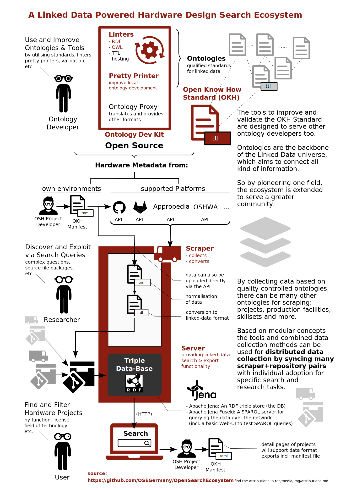

# Open Search Ecosystem 
> **towards Linked Data powered (open source) hardware search, high-quality engineering ontologies and tools for developers**

Public resources related to the [Open Know-How (OKH)][OKH] Standard
regarding a future Open Search Ecosystem for hardware ([NGI Search Project 2025]). 

For a detailed list of resources we are building this ecosystem on check out the [Repositories.md](Repositories.md) documentation. If you find something missing or want to suggest modules for this ecosystem to grow better please file an [Issue](https://github.com/OSEGermany/OpenSearchEcosystem/issues/new) or send your suggestions via [Merge Request](https://github.com/OSEGermany/OpenSearchEcosystem/compare).

>*The modules in red (color: #8e1d11) are specifically linked to the [NGI Search Project 2025]. Though the Ecosystem is growing beyond those elements already.*

**For a detailed graphical outline of all the modules and repositories in place, please check out the [dataflow-principle.svg](res/media/img/dataflow-principle.svg)!**

Other resources will follow on [Codeberg.org/OSEGermany](https://codeberg.org/OSEGermany).

[OKH]: https://github.com/iop-alliance/OpenKnowHow
[NGI Search Project 2025]: https://www.ngisearch.eu/view/Events/OC5Searchers#HOSE
